# Práctica Kubernetes — Despliegue de Aplicaciones en un Clúster con kubeadm

**Asignatura:** Infraestructura III  
**Entorno:** Clúster Kubernetes (kubeadm) sobre VirtualBox  
**Autor:** Esteban Guarin Valencia.  
**Repositorio base:** https://github.com/mariocr73/K8S-apps   
**Infraestructura:** https://github.com/Esteban-GV/k8s-InfraIII  

---
# Tabla de Contenidos

1. [Descripción del entorno](#1-descripción-del-entorno)
2. [Fase 1 — Preparación del entorno](#2-fase-1--preparación-del-entorno)
3. [Fase 2 — Revisión del repositorio](#3-fase-2--revisión-del-repositorio)
4. [Fase 3 — Despliegue de la aplicación](#4-fase-3--despliegue-de-la-aplicación)
5. [Fase 4 — Exposición del servicio](#5-fase-4--exposición-del-servicio)
6. [Fase 5 — Escalamiento de la aplicación](#6-fase-5--escalamiento-de-la-aplicación)
7. [Fase 6 — Prueba de resiliencia (Self-Healing)](#7-fase-6--prueba-de-resiliencia-self-healing)
8. [Conclusión](#8-conclusión)

---

# 1. Descripción del Entorno

En este laboratorio se trabajó con un clúster de Kubernetes construido mediante **kubeadm**, automatizado previamente con **Ansible** y ejecutado sobre **VirtualBox**.

El entorno utilizado cumple con los siguientes requisitos:

- Clúster Kubernetes funcional ejecutándose en máquinas virtuales.
- Nodo **Control Plane (Master)** accesible.
- Herramienta **kubectl** configurada correctamente.
- **Git** instalado para clonar repositorios.

---

# 2. Fase 1 — Preparación del Entorno

El primer paso consistió en preparar el entorno de trabajo descargando el repositorio de la aplicación y verificando el estado del clúster.

## Clonar el repositorio

```bash
git clone https://github.com/mariocr73/K8S-apps.git
cd K8S-apps
```

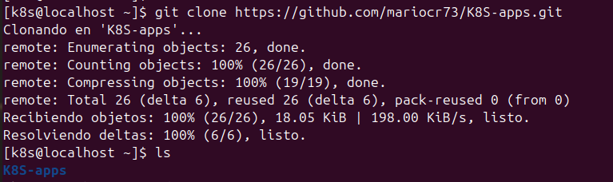

## Verificar el estado del clúster

```bash
kubectl get nodes
```

Resultado esperado:

Todos los nodos del clúster deben aparecer en estado **Ready**, indicando que están disponibles para ejecutar cargas de trabajo.

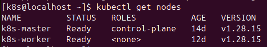


# 3. Fase 2 — Revisión del Repositorio

Antes de desplegar la aplicación, se analizó la estructura del repositorio para identificar los recursos de Kubernetes definidos.

Los archivos YAML incluidos describen distintos tipos de recursos del clúster.

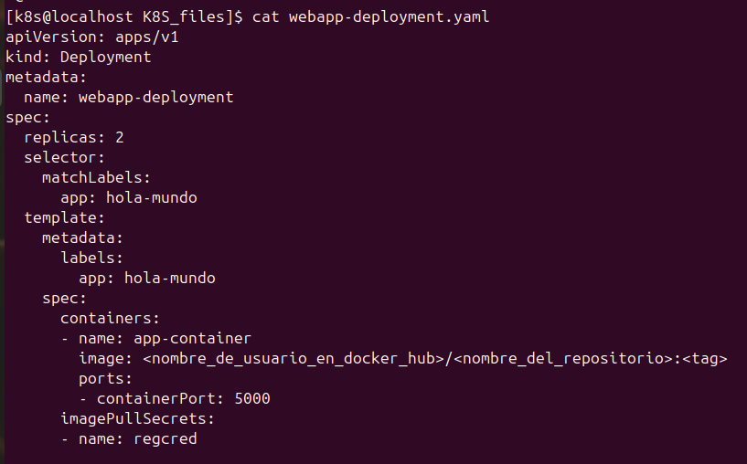

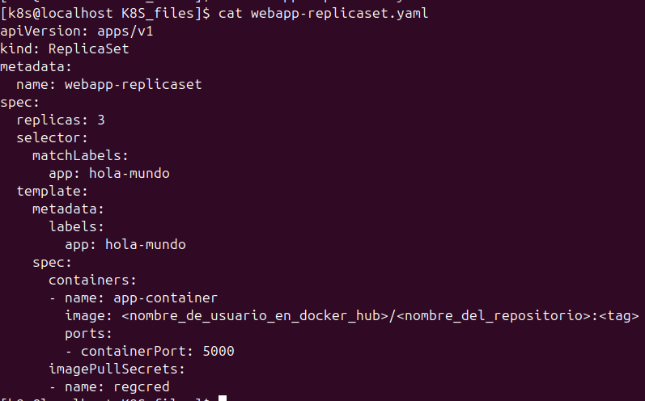

Al revisar los archivos webapp-dhsecret.yaml y webapp-dbsecret.yaml se observa que los campos a cambiar se deben colocar en base64 o daran un error que más adelante se visualizara, para ello, para evitar utilizar una pagina, aplicación o comando para pasar los datos a base64 se puede simplemente cambiar **data** por **StringData** como se puede observar en las capturas.

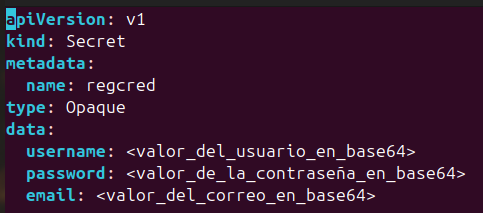

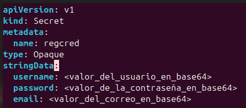

Para al final poder tenerlos de la siguiente manera a ambos para que no generen error más delante:

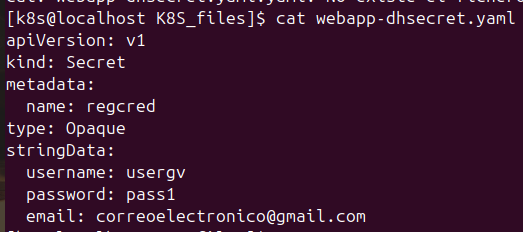

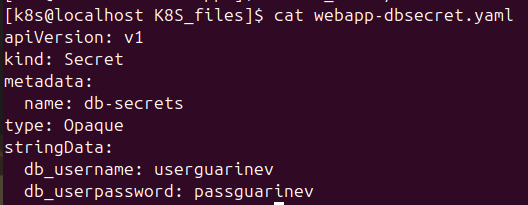

Y cambiar los datos de webapp-deployment.yaml y webapp-replicaset.yaml para que queden con la ruta de nuestro dockerhub:

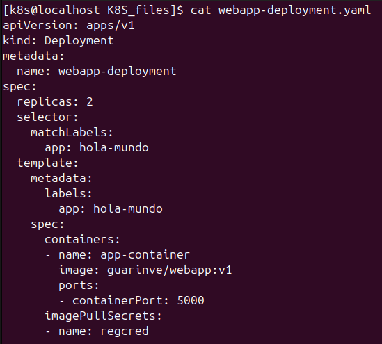

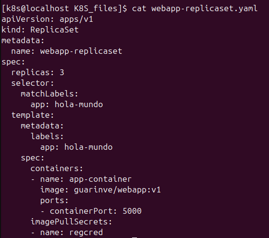

## Deployments

Los **Deployments** permiten definir el estado deseado de una aplicación, incluyendo:

- Número de réplicas
- Imagen del contenedor
- Estrategia de actualización

## Services

Los **Services** proporcionan un punto de acceso estable hacia los Pods de la aplicación. Esto permite que otros servicios o usuarios puedan comunicarse con la aplicación sin depender de la IP dinámica de los Pods.

### Pregunta obligatoria

**¿Por qué utilizar un Deployment en lugar de crear Pods directamente?**

Esto es ya que en Kubernetes no se recomienda crear Pods directamente porque son recursos efímeros. Si un Pod falla, se elimina o el nodo donde se ejecuta presenta problemas, el Pod no será recreado automáticamente y se perdera.

Un **Deployment** actúa como un controlador que supervisa el estado del sistema. A través de un **ReplicaSet**, Kubernetes mantiene el número de Pods definido en el manifiesto. Si alguno de los Pods deja de existir, el controlador crea uno nuevo automáticamente para restaurar el estado deseado, permitiendo así una atomatización del servicio y menos tiempo de espera para crear uno de nuevo.

Además, los Deployments permiten:

- Escalar aplicaciones fácilmente.
- Realizar actualizaciones sin tiempo de inactividad.
- Garantizar disponibilidad mediante mecanismos de auto-recuperación.

---

# 4. Fase 3 — Despliegue de la Aplicación

Una vez revisados los manifiestos del repositorio y corregidos, se procedió a desplegar los recursos en el clúster.

## Aplicar los manifiestos

```bash
kubectl apply -f .
```
La siguiente captura es el error que se arrojo antes de cambiar los yaml dbsecret y el dhsecret, que se han resolvido anteriormente.

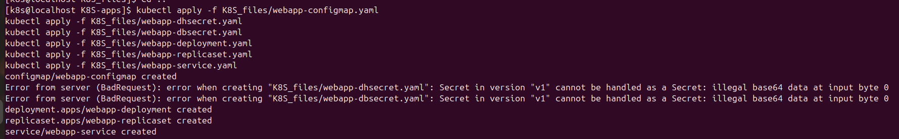


## Verificar los recursos creados

```bash
kubectl get pods
kubectl get deployments
kubectl get services
```

Estos comandos permiten verificar que los recursos se han creado correctamente y que los Pods se encuentran en estado **Running**.

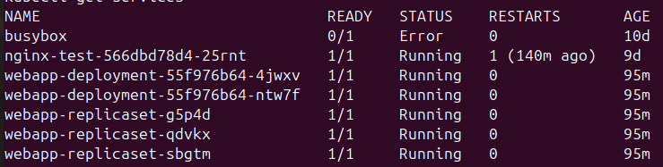

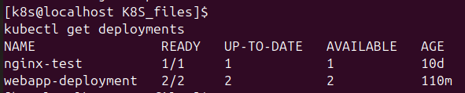

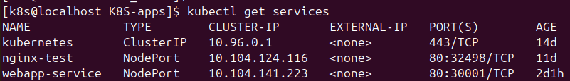

---


# 5. Fase 4 — Exposición del Servicio

Después de desplegar la aplicación, se revisó el servicio configurado para permitir el acceso a la aplicación.

## Describir el servicio

```bash
kubectl describe svc
```

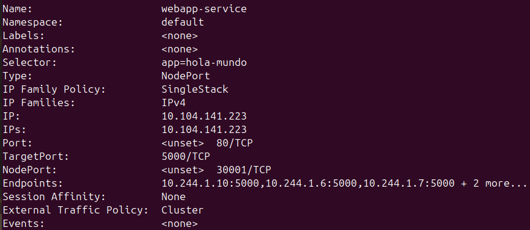

Dependiendo de la configuración, el servicio puede ser de tipo:

- **ClusterIP** (acceso interno dentro del clúster)
- **NodePort** (acceso externo mediante el nodo)

Para pruebas locales se utilizó **port-forward**.

## Acceso mediante port-forward

```bash
kubectl port-forward svc/<nombre-servicio> 8080:80
```
Este comando redirige el puerto **8080** de la máquina local hacia el puerto **80** del servicio dentro del clúster.

O tambien puede ser mediante el siguiente comando:

```bash
NODE_PORT=$(kubectl get svc webapp-service -o jsonpath='{.spec.ports[0].nodePort}')
curl http://192.168.100.21:$NODE_PORT
```
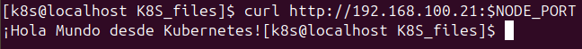

---

# 6. Fase 5 — Escalamiento de la Aplicación

Kubernetes permite escalar aplicaciones fácilmente aumentando el número de réplicas de un Deployment.

En esta fase se incrementó el número de Pods para mejorar la disponibilidad del servicio.

## Escalar el Deployment

```bash
kubectl scale deployment <nombre-deployment> --replicas=3
```

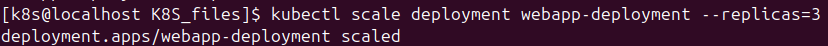

## Verificar el escalamiento

```bash
kubectl get pods
```

Como resultado, Kubernetes crea automáticamente los Pods adicionales necesarios hasta alcanzar las **3 réplicas** definidas.

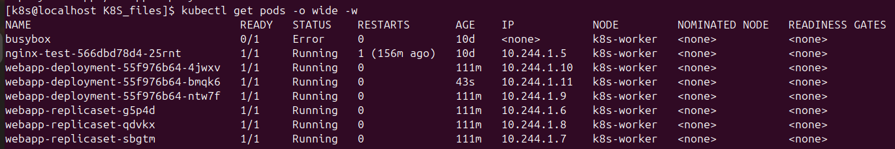

---

# 7. Fase 6 — Prueba de Resiliencia (Self-Healing)

Para validar la capacidad de recuperación automática de Kubernetes, se eliminó manualmente uno de los Pods en ejecución.

## Eliminar un Pod

```bash
kubectl delete pod <nombre-pod>
```

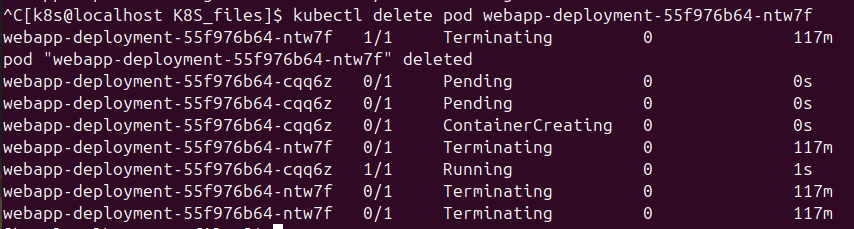


## Análisis del comportamiento

Al eliminar el Pod, Kubernetes detecta que el estado actual del sistema ya no coincide con el estado deseado definido en el Deployment.

El proceso ocurre de la siguiente manera:

1. El **Deployment Controller** detecta la diferencia entre el estado actual y el estado deseado.
2. El **ReplicaSet Controller** ordena la creación de un nuevo Pod.
3. Kubernetes programa el nuevo Pod en uno de los nodos disponibles del clúster.

Este comportamiento demuestra la funcionalidad de **self-healing**, que permite a Kubernetes mantener las aplicaciones disponibles incluso ante fallos.


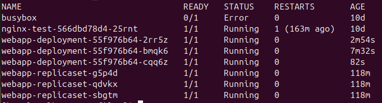

---

# 8. Conclusión

Esta práctica permitió comprender el funcionamiento de Kubernetes al gestionar un clúster propio utilizando **kubeadm**.

Durante el laboratorio se observaron varios conceptos fundamentales:

- Gestión declarativa de recursos mediante archivos YAML.
- Uso de **Deployments** para mantener el estado deseado de la aplicación.
- Exposición de servicios dentro del clúster.
- Escalamiento manual de aplicaciones.
- Capacidad de **auto-recuperación (self-healing)**.

Estos mecanismos son esenciales en infraestructuras modernas basadas en contenedores, donde la disponibilidad, la escalabilidad y la resiliencia son aspectos críticos para el funcionamiento de los servicios.

